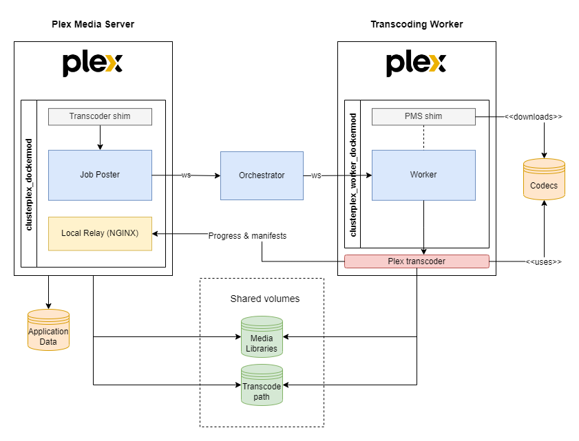
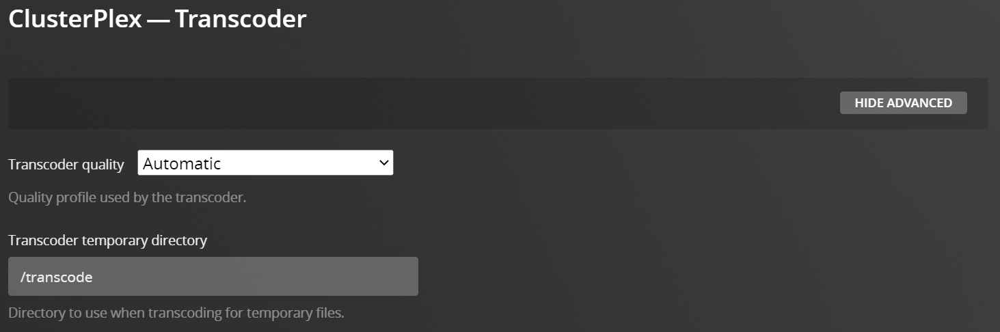

# ClusterPlex

## What is it?

ClusterPlex is basically an extended version of [Plex](https://plex.tv), which supports distributed Workers across a cluster to handle transcoding requests.
It has been tested on Kubernetes and Docker Swarm.

## Components

It's made up of 3 parts:

* ### Plex Media Server
  There are two alternatives here:
  1. **RECOMMENDED:** Running the Official LinuxServer Plex image (ghcr.io/linuxserver/plex:latest) and applying the ClusterPlex dockermod (ghcr.io/pabloromeo/clusterplex_dockermod:latest)
  2. Running the ClusterPlex PMS docker image (ghcr.io/pabloromeo/clusterplex_pms:latest)
* ### Transcoding Orchestrator
  Running a container using ghcr.io/pabloromeo/clusterplex_orchestrator:latest
* ### Transcoding Workers
  Just as with PMS, two alternatives:
  1. **RECOMMENDED:** Official image (ghcr.io/linuxserver/plex:latest) with the Worker dockermod (ghcr.io/pabloromeo/clusterplex_worker_dockermod:latest)
  2. Custom Docker image: ghcr.io/pabloromeo/clusterplex_worker:latest

## How does it work?

* In the customized PMS server, Plex’s own transcoder is renamed and a shim is put in its place which calls a small Node.js app that communicates with the Orchestrator container over websockets.
Also, a Local Relay is installed (an NGINX forward-proxy) which forwards calls coming from Workers to PMS as if they were made locally.

* The Orchestrator (Node.js application which receives all transcoding requests from PMS) forwards it to one of the active Workers available over websockets.

* Workers receive requests from the Orchestrator and kick off the transcoding and report progress back to the Local Relay running on PMS. Workers can come online or go offline and the Orchestrator manages their registrations and availability. These Workers can run as replicated services managed by the cluster.

## Requirements

You will need to have a mechanism for sharing content between PMS and your Workers that supports ReadWriteMany (RWX).

This can be NFS, SMB, Ceph, GlusterFS or Longhorn, to name a few.

The content that needs to be shared are the *Media Libraries*, and the *transcoding* location, and paths MUST be the same on all workers and the main PMS.

## Shared Storage

### Media Libraries

In order for Workers to function properly, all Media content should be shared using identical paths between PMS and the Workers.
This would be using network shared storage supporting ReadWriteMany (RWX), such as NFS, SMB, Ceph, GlusterFS, Longhorn, etc.

### Transcoding location

The same applies to the **/transcode** directory, in both PMS and the Workers. You CAN use a different directory name other than `/transcode`, however, it MUST match between PMS and all Workers, as well as be configured within Plex as the transcoding path:

## Non-shared Persistent Storage

### Plex Application Data
**IMPORTANT:** PMS's Application Data mount (/config) does NOT need to be shared with the Workers, so you can use your preferred method for persistent storage. Just beware that Plex doesn't play very well with network storage for this, especially regarding symlinks and file locks (used by their sqlite db).

**The recommendation is to use Ceph, Longhorn or GlusterFS.**

### Codecs

Workers require a path to store downloaded codecs for the particular architecture of the Worker.
Codecs are downloaded when the worker container starts up.

The path within the container is **/codecs**, which you can mount to a volume in order to have them persisted across container recreations. Subdirectories for each plex version and architecture are created within it.

## Network settings in PMS ##
Latest versions of ClusterPlex don't require any special network configuration, due to the new **Local Relay** functionality which forwards calls from Workers to Plex, which is enabled by default.

However, if you have disabled Local Relay by setting `LOCAL_RELAY_ENABLED` to `"0"`, then in Plex's `Network` Configuration, you must add the IPs or the range that will be used by Workers to the `"List of IP addresses and networks that are allowed without auth"`.

For example:

## Installation

See the [docs](docs/) section for details on each component's configuration parameters and example configurations both on Kubernetes and Docker Swarm.

* [Configuration Parameters](docs/)
* [On Kubernetes](docs/kubernetes/)
* [On Docker Swarm](docs/docker-swarm/)
* [Grafana Dashboard and Metrics](docs/grafana-dashboard/)
* [On Kubernetes via Helm](https://pabloromeo.github.io/clusterplex)
