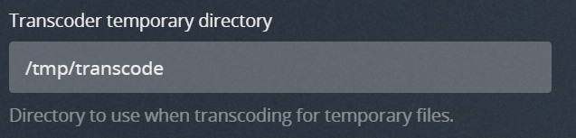
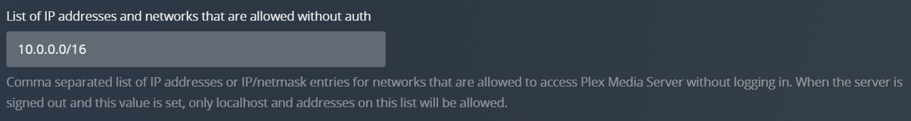

# ClusterPlex
[](https://github.com/pabloromeo/clusterplex/blob/master/LICENSE)
[](https://GitHub.com/pabloromeo/clusterplex/releases/)
[](https://github.com/pabloromeo/clusterplex/actions)

## What is it?

ClusterPlex is basically an extended version of Plex, which supports distributed Workers across a cluster to handle transcoding requests.

[Plex](https://plex.tv) organizes video, music and photos from personal media libraries and streams them to smart TVs, streaming boxes and mobile devices.


## Components

In order to be able to use multiple nodes for transcoding, it's made up of 3 parts:

* ### Plex Media Server
  There are two alternatives here:
  1. **RECOMMENDED:** Running the Official LinuxServer Plex image (ghcr.io/linuxserver/plex:latest) and applying the ClusterPlex dockermod (ghcr.io/pabloromeo/clusterplex_dockermod:latest)
  2. Running the ClusterPlex PMS docker image (ghcr.io/pabloromeo/clusterplex_pms:latest)
* ### Transcoding Orchestrator
  Running a container using ghcr.io/pabloromeo/clusterplex_orchestrator:latest
* ### Transcoding Workers
  Just as with PMS, two alternatives:
  1. **RECOMMENDED:** Official image (ghcr.io/linuxserver/plex:latest) with the Worker dockermod (ghcr.io/pabloromeo/clusterplex_worker_dockermod:latest)
  2. Custom Docker image: ghcr.io/pabloromeo/clusterplex_worker:latest

## How does it work?

* In the customized PMS server, Plex’s own transcoder is renamed and a shim is put in its place which calls a small Node.js app that communicates with the Orchestrator container over websockets.

* The Orchestrator (Node.js application which receives all transcoding requests from PMS and forwards it to one of the active Workers available over websockets.

* Workers receive requests from the Orchestrator and kick off the transcoding and report progress back to PMS. Workers can come online or go offline and the Orchestrator manages their registrations and availability. These Workers can run as replicated services managed by the cluster.

## Shared content

### Plex Application Data
**WARNING:** PMS's Application Data mount (/config) doesn't need to be shared with the Workers, so you can use your preferred method for persistent storage. However, beware that Plex doesn't play very well with network storage for this, especially regarding symlinks and file locks (used by their sqlite db).

For this reason CIFS/SMB should be avoided for this mount. NFS has been shown to work, but it is very sensitive to how the server and the mount is finetunned through configuration and may not work.

**The recommendation is to use GlusterFS or Ceph**

### Media

In order for Workers to function properly, all Media content should be shared using identical paths between PMS and the Workers.
This would be using network shared storage, such as NFS, SMB, Ceph, Gluster, etc.

### Temp & Transcoding location

The same applies to the **/tmp** directory, in both PMS and the Workers. And the transcoding path configured in Plex should be a subdirectory of **/tmp**.

Such as:



### Codecs

Workers require a path to store downloaded codecs for the particular architecture of the Worker.
Codecs are downloaded as needed, whenever a transcoding request is received.

These can be shared across Workers, if desired, in order to avoid downloading the same codec for each Worker, but it isn't mandatory.

The path within the container is **/codecs**, which you can mount to a volume in order to have them persisted across container recreations. Subdirectories for each plex version and architecture are created within it.
 
## Network settings in PMS ##
In Plex's `Network` Configuration, add Docker's VLAN (or the range that will be used by Workers) to the `"List of IP addresses and networks that are allowed without auth"`.

For example:



## Example Docker Swarm Deployment


### Docker Swarm stack example using Dockermods:

```yaml
---
version: '3.4'

services:
  plex:
    image: ghcr.io/linuxserver/plex:latest
    deploy:
      mode: replicated
      replicas: 1
    environment:
      DOCKER_MODS: "ghcr.io/pabloromeo/clusterplex_dockermod:latest"
      VERSION: docker
      PUID: 1000
      PGID: 1000
      TZ: Europe/London
      ORCHESTRATOR_URL: http://plex-orchestrator:3500
      PMS_IP: 192.168.2.1
      TRANSCODE_OPERATING_MODE: both #(local|remote|both)
      TRANSCODER_VERBOSE: "1"   # 1=verbose, 0=silent
    healthcheck:
      test: curl -fsS http://localhost:32400/identity > /dev/null || exit 1
      interval: 15s
      timeout: 15s
      retries: 5
      start_period: 30s
    volumes:
      - /path/to/config:/config
      - /path/to/backups:/backups
      - /path/to/tv:/data/tv
      - /path/to/movies:/data/movies
      - /path/to/tmp:/tmp
      - /etc/localtime:/etc/localtime:ro
    ports:
      - 32469:32469
      - 32400:32400
      - 3005:3005
      - 8324:8324
      - 1900:1900/udp
      - 32410:32410/udp
      - 32412:32412/udp
      - 32413:32413/udp
      - 32414:32414/udp

  plex-orchestrator:
    image: ghcr.io/pabloromeo/clusterplex_orchestrator:latest
    deploy:
      mode: replicated
      replicas: 1
      update_config:
        order: start-first
    healthcheck:
      test: curl -fsS http://localhost:3500/health > /dev/null || exit 1
      interval: 15s
      timeout: 15s
      retries: 5
      start_period: 30s
    environment:
      TZ: Europe/London
      STREAM_SPLITTING: "OFF" # ON | OFF (default)
      LISTENING_PORT: 3500
      WORKER_SELECTION_STRATEGY: "LOAD_RANK" # RR | LOAD_CPU | LOAD_TASKS | LOAD_RANK (default)
    volumes:
      - /etc/localtime:/etc/localtime:ro
    ports:
      - 3500:3500

  plex-worker:
    image: ghcr.io/linuxserver/plex:latest
    hostname: "plex-worker-{{.Node.Hostname}}"
    deploy:
      mode: global
      update_config:
        order: start-first
    environment:
      DOCKER_MODS: "ghcr.io/pabloromeo/clusterplex_worker_dockermod:latest"
      VERSION: docker
      PUID: 1000
      PGID: 1000
      TZ: Europe/London
      LISTENING_PORT: 3501      # used by the healthcheck
      STAT_CPU_INTERVAL: 2000   # interval for reporting worker load metrics
      ORCHESTRATOR_URL: http://plex-orchestrator:3500
    healthcheck:
      test: curl -fsS http://localhost:3501/health > /dev/null || exit 1
      interval: 15s
      timeout: 15s
      retries: 5
      start_period: 240s
    volumes:
      - /path/to/codecs:/codecs # (optional, can be used to share codecs)
      - /path/to/tv:/data/tv
      - /path/to/movies:/data/movies
      - /path/to/tmp:/tmp
      - /etc/localtime:/etc/localtime:ro

```

### Docker Swarm stack example using ClusterPlex docker images:

```yaml
---
version: '3.4'

services:
  plex:
    image: ghcr.io/pabloromeo/clusterplex_pms:latest
    deploy:
      mode: replicated
      replicas: 1
    environment:
      VERSION: docker
      PUID: 1000
      PGID: 1000
      TZ: Europe/London
      ORCHESTRATOR_URL: http://plex-orchestrator:3500
      PMS_IP: 192.168.2.1
      TRANSCODE_OPERATING_MODE: both #(local|remote|both)
      TRANSCODER_VERBOSE: "1"   # 1=verbose, 0=silent
    healthcheck:
      test: curl -fsS http://localhost:32400/identity > /dev/null || exit 1
      interval: 15s
      timeout: 15s
      retries: 5
      start_period: 30s
    volumes:
      - /path/to/config:/config
      - /path/to/backups:/backups
      - /path/to/tv:/data/tv
      - /path/to/movies:/data/movies
      - /path/to/tmp:/tmp
      - /etc/localtime:/etc/localtime:ro
    ports:
      - 32469:32469
      - 32400:32400
      - 3005:3005
      - 8324:8324
      - 1900:1900/udp
      - 32410:32410/udp
      - 32412:32412/udp
      - 32413:32413/udp
      - 32414:32414/udp

  plex-orchestrator:
    image: ghcr.io/pabloromeo/clusterplex_orchestrator:latest
    deploy:
      mode: replicated
      replicas: 1
      update_config:
        order: start-first
    healthcheck:
      test: curl -fsS http://localhost:3500/health > /dev/null || exit 1
      interval: 15s
      timeout: 15s
      retries: 5
      start_period: 30s
    environment:
      TZ: Europe/London
      STREAM_SPLITTING: "OFF" # ON | OFF (default)
      LISTENING_PORT: 3500
      WORKER_SELECTION_STRATEGY: "LOAD_RANK" # RR | LOAD_CPU | LOAD_TASKS | LOAD_RANK (default)
    volumes:
      - /etc/localtime:/etc/localtime:ro
    ports:
      - 3500:3500

  plex-worker:
    image: ghcr.io/pabloromeo/clusterplex_worker:latest
    hostname: "plex-worker-{{.Node.Hostname}}"
    deploy:
      mode: global
      update_config:
        order: start-first
    environment:
      VERSION: docker
      PUID: 1000
      PGID: 1000
      TZ: Europe/London
      LISTENING_PORT: 3501      # used by the healthcheck
      STAT_CPU_INTERVAL: 2000   # interval for reporting worker load metrics
      ORCHESTRATOR_URL: http://plex-orchestrator:3500
    healthcheck:
      test: curl -fsS http://localhost:3501/health > /dev/null || exit 1
      interval: 15s
      timeout: 15s
      retries: 5
      start_period: 240s
    volumes:
      - /path/to/codecs:/codecs # (optional, can be used to share codecs)
      - /path/to/tv:/data/tv
      - /path/to/movies:/data/movies
      - /path/to/tmp:/tmp
      - /etc/localtime:/etc/localtime:ro

```

## Parameters

### Plex

The image extends the [LinuxServer Plex](https://hub.docker.com/r/linuxserver/plex/) Image, see [here](https://hub.docker.com/r/linuxserver/plex/) for information on all its parameters.

| Parameter | Function |
| :----: | --- |
| `ORCHESTRATOR_URL` | The url where the orchestrator service can be reached (ex: http://plex-orchestrator:3500) |
| `PMS_IP` | IP pointing at the Plex instance (can be the cluster IP) |
| `TRANSCODE_EAE_LOCALLY` | Force media which requires EasyAudioEncoder to transcode locally |
| `TRANSCODE_OPERATING_MODE` | "local" => only local transcoding (no workers), "remote" => only remote workers transcoding, "both" (default) => Remote first, local if it fails |
| `TRANSCODER_VERBOSE` | "0" (default) => info level, "1" => debug logging |

### Orchestrator

| Parameter | Function |
| :----: | --- |
| `TZ` | Timezone |
| `STREAM_SPLITTING` | Experimental feature, only "OFF" is allowed |
| `LISTENING_PORT` | Port where orchestrator should run |
| `WORKER_SELECTION_STRATEGY` | How the worker is chosen: "LOAD_CPU" => lowest CPU usage, "LOAD_TASKS" => least amount of current tasks, "RR" => round-robin, "LOAD_RANK" (default) => CPU benchmark * free_cpu |

#### Orchestrator metrics

The Orchestrator exposes usage metrics at */metrics*, in Prometheus format.

```
# HELP jobs_posted Jobs Posted
# TYPE jobs_posted counter
jobs_posted 0

# HELP jobs_completed Jobs Completed
# TYPE jobs_completed counter
jobs_completed 0

# HELP jobs_succeeded Jobs Succeeded
# TYPE jobs_succeeded counter
jobs_succeeded 0

# HELP jobs_failed Jobs Failed
# TYPE jobs_failed counter
jobs_failed 0

# HELP jobs_killed Jobs Killed
# TYPE jobs_killed counter
jobs_killed 0

# HELP job_posters_active Active Job Posters
# TYPE job_posters_active gauge
job_posters_active 0

# HELP workers_active Active Workers
# TYPE workers_active gauge
workers_active 2

# HELP worker_load_cpu Worker Load - CPU usage
# TYPE worker_load_cpu gauge
worker_load_cpu{worker_id="869902cf-5f95-49ec-8d4e-c49ff9bee914",worker_name="NODE1"} 28.13
worker_load_cpu{worker_id="61e06076-4b9e-4d83-bcaa-1385f2d8f414",worker_name="NODE2"} 11.97

# HELP worker_load_tasks Worker Load - Tasks Count
# TYPE worker_load_tasks gauge
worker_load_tasks{worker_id="869902cf-5f95-49ec-8d4e-c49ff9bee914",worker_name="NODE1"} 1
worker_load_tasks{worker_id="61e06076-4b9e-4d83-bcaa-1385f2d8f414",worker_name="NODE2"} 0
```

Using these metrics you can create Dashboards in something like Grafana, such as:


Dashboard JSON file:
[samples/grafana-dashboard.json](samples/grafana-dashboard.json)

### Workers

The image extends the [LinuxServer Plex](https://hub.docker.com/r/linuxserver/plex/) Image, see [here](https://hub.docker.com/r/linuxserver/plex/) for information on all its parameters.

| Parameter | Function |
| :----: | --- |
| `FFMPEG_HWACCEL` | Allows a [hwaccel decoder](https://trac.ffmpeg.org/wiki/HWAccelIntro) to be passed to ffmpeg such as `nvdec` or `dvxa2` |
| `LISTENING_PORT` | Port where workers expose the internal healthcheck |
| `STAT_CPU_INTERVAL` | Frequency at which the worker sends stats to the orchestrator (in ms). Default 2000 |
| `ORCHESTRATOR_URL` | The url where the orchestrator service can be reached (ex: http://plex-orchestrator:3500) |
| `TRANSCODER_PATH` | Default = '/usr/lib/plexmediaserver/' |
| `TRANSCODER_NAME` | Default = 'Plex Transcoder' |
