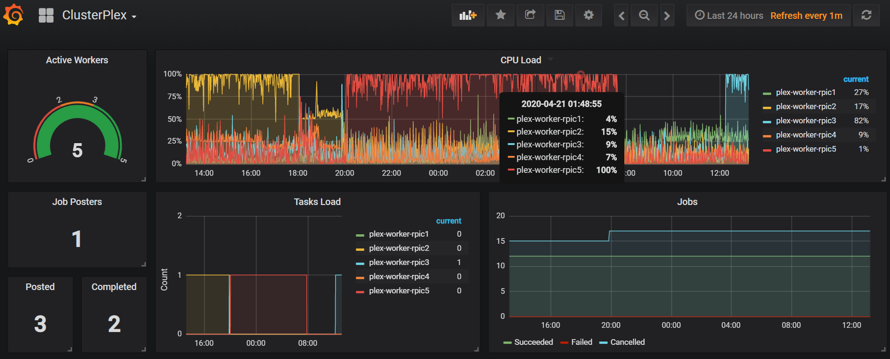

## Deployment Examples

* [Deploying on Kubernetes](kubernetes/)
* [Deploying on Docker Swarm](docker-swarm/)
* [Grafana Dashboard Example](grafana-dashboard/)

## Configuration Parameters

### Plex (PMS)

The image extends the [LinuxServer Plex](https://hub.docker.com/r/linuxserver/plex/) Image, see [here](https://hub.docker.com/r/linuxserver/plex/) for information on all its parameters.

| Parameter | Function |
| :----: | --- |
| `ORCHESTRATOR_URL` | The url where the orchestrator service can be reached (ex: http://plex-orchestrator:3500) |
| `PMS_SERVICE` or `PMS_IP` | Referencing Plex by Service name is allowed if `LOCAL_RELAY_ENABLED` is `"1"` (which is the default). If you are not using Local Relay then specify `PLEX_IP`, which also requires you to add the workers subnets to `"List of IP addresses and networks that are allowed without auth"` |
| `TRANSCODE_EAE_LOCALLY` | `"true"` or `"false"`. Force media which requires EasyAudioEncoder to transcode locally. Given that EAE is currently supported by the latest versions of ClusterPlex there's usually no reason to enable this. It will most likely be deprecated in the future. Default => `"false"`|
| `TRANSCODE_OPERATING_MODE` | `"local"` => only local transcoding (no workers) `"remote"` => only remote workers transcoding `"both"` (default) => Remote first, local if it fails |
| `TRANSCODER_VERBOSE` | `"0"` (default) => info level, `"1"` => debug logging |
| `FORCE_HTTPS` | `"0"` (Default) uses Plex's default http callback, `"1"` forces HTTPS to be used. **IMPORTANT:** Turning this on is only required if you have BOTH disabled Local Relay and have `Secure Connetions` in Plex set to `Required`. |

### Orchestrator

| Parameter | Function |
| :----: | --- |
| `TZ` | Timezone |
| `LISTENING_PORT` | Port where orchestrator should run |
| `WORKER_SELECTION_STRATEGY` | How the worker is chosen when a transcoding job is initiated:  `"LOAD_CPU"` => lowest CPU usage `"LOAD_TASKS"` => least amount of current tasks `"RR"` => round-robin `"LOAD_RANK"` (default) => CPU benchmark * free_cpu |

#### Orchestrator metrics

The Orchestrator exposes usage metrics at */metrics*, in Prometheus format.

Using these metrics you can create Dashboards in something like Grafana, such as:

Dashboard JSON file:
[grafana-dashboard/grafana-dashboard.json](grafana-dashboard/grafana-dashboard.json)

### Workers

The image extends the [LinuxServer Plex](https://hub.docker.com/r/linuxserver/plex/) Image, see [here](https://hub.docker.com/r/linuxserver/plex/) for information on all its parameters.

| Parameter | Function |
| :----: | --- |
| `FFMPEG_HWACCEL` | Allows a [hwaccel decoder](https://trac.ffmpeg.org/wiki/HWAccelIntro) to be passed to ffmpeg such as `nvdec` or `dvxa2` |
| `EAE_SUPPORT` | `"1"` for ON, `"0"` for OFF, controls usage of EasyAudioEncoder (Default = `"1"`) |
| `LISTENING_PORT` | Port where workers expose the internal healthcheck |
| `STAT_CPU_INTERVAL` | Frequency at which the worker sends stats to the orchestrator (in ms). Default 2000 |
| `ORCHESTRATOR_URL` | The url where the orchestrator service can be reached (ex: http://plex-orchestrator:3500) |
| `TRANSCODER_PATH` | Default = `'/usr/lib/plexmediaserver/'` |
| `TRANSCODER_NAME` | Default = `'Plex Transcoder'` |
